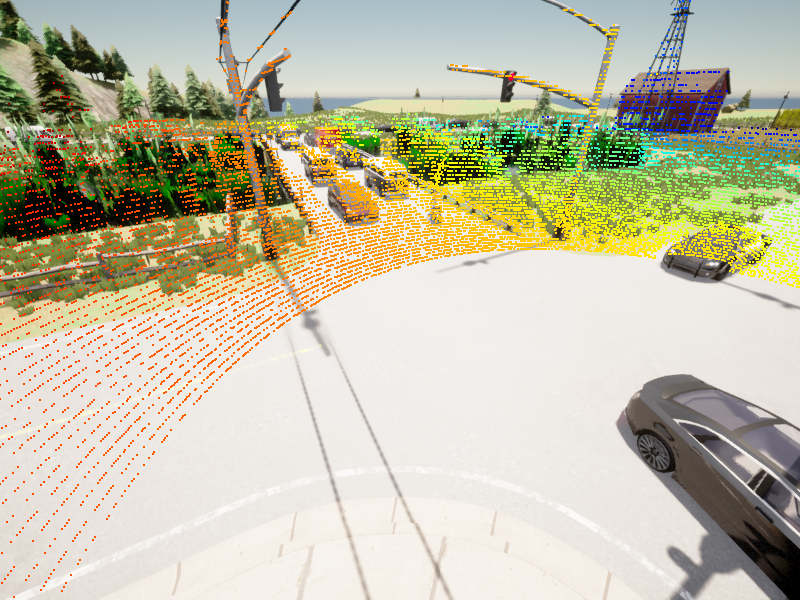
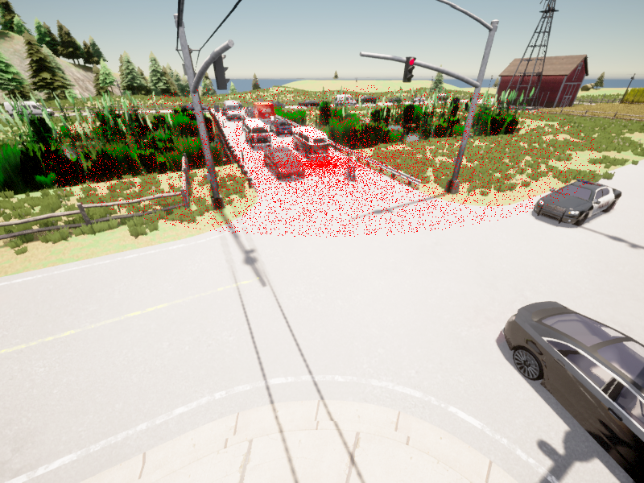
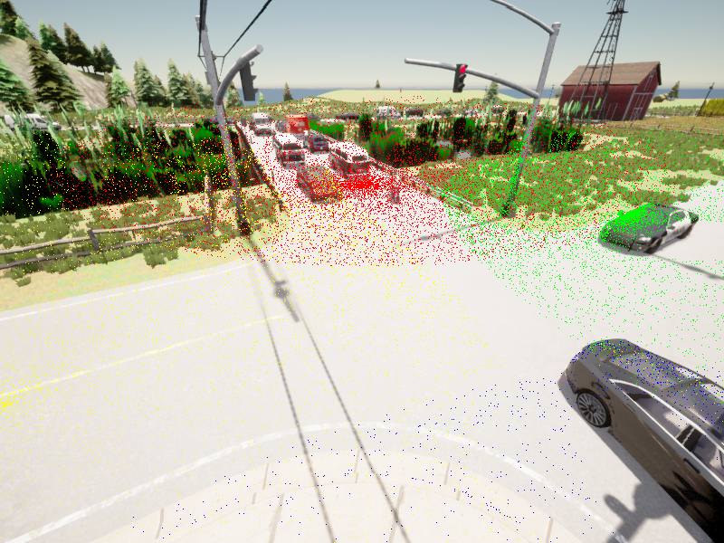
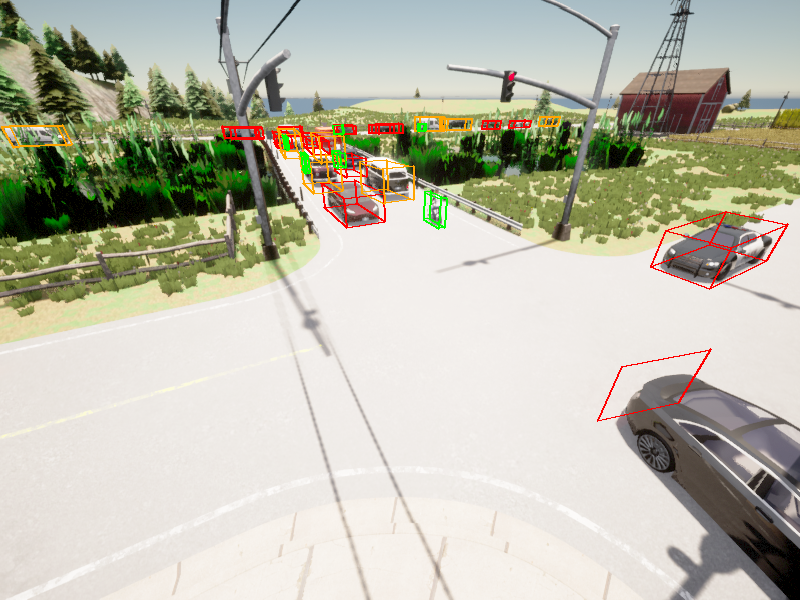
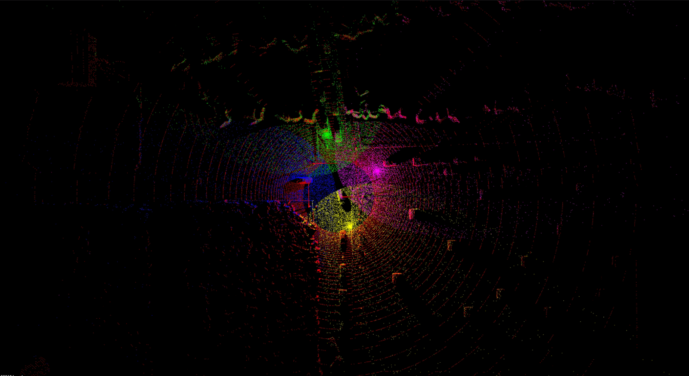
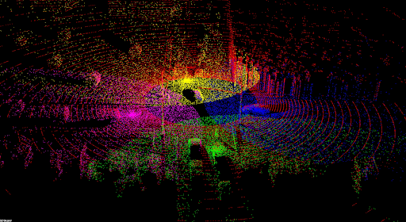
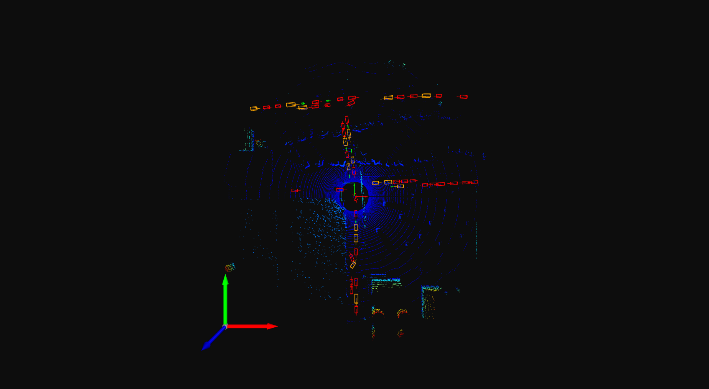

# dataset_tool

## Installation

### Step 1: Install Package and Environment
``` bash
git clone https://github.com/zhz03/dataset_tool
cd dataset_tool
conda create -n datatool python=3.7
conda activate datatool
python setup.py develop
pip install -r requirements.txt
```

### Step 2: Install CARLA (Optional)
This is optional -- if you need to use Carla package for your simulation data, you will need to install the `carla` package:

``` bash
export CARLA_HOME=/path/to/your/CARLA_ROOT # e.g. /home/zzl/Carla/CARLA_0.9.12
export CARLA_VERSION=0.9.12 #or 0.9.14 depending on your CARLA version
. setup.sh
```

Note: This shouldn't be an issue, but if your Python version is 3.8 or 3.9, then running `. setup.sh` will crash. Then, you will have to manually install Carla package after you finish running `. setup.sh`:

```bash
# You will see a cache directory after you finish 
# And install it manually:
export CARLA_VERSION=0.9.14
conda activate datatool
pip install -e $cache/carla-"${CARLA_VERSION}"-py3.7-linux-x86_64
```

### Pytorch
``` bash
conda activate datatool
## CPU versions are ok
pip install torch torchvision torchaudio
```

## V2X-InfraSet Data Verification

### Input Data Format
For 4cam scenarios -- 4 cameras, 4 radars, 4 lidars, and 1 yaml expected per frame.
``` bash
├── input_root_path
│   ├── [frameID]_camera0.png
│   ├── [frameID]_camera1.png
│   ├── [frameID]_camera2.png
│   ├── [frameID]_camera3.png
│   ├── [frameID]_lidar0.pcd
│   ├── [frameID]_radar0.pcd
│   ├── [frameID]_radar1.pcd
│   ├── [frameID]_radar2.pcd
│   ├── [frameID]_radar3.pcd
│   ├── [frameID].yaml
...
```
For an example yaml format, see `/dataset_tool/data_examples/v2x-real/radar/000031.yaml`.

### Lidar2Camera Verification
```python
'''
Project LiDAR point cloud on to camera image captured in Carla. Specify the:

:param yaml_path: File path of yaml.
:param index: Index of camera (0-3) to project point cloud on to.
:param vis_flag: Also show visualization in popup window (True) or only save image output (False).
:param output_dir: File path of directory to save visualization results to.
'''
from verify_dataset.proj_lidar2cam import ProjLidar2Cam

lidar2cam_proj = ProjLidar2Cam(point_size=1.0) # point_size: size of LiDAR points in projection visualization
lidar2cam_proj.single_img_lidar_proj_smart_index(yaml_path, index=0, output_dir=output_dir, vis_flag=False)
```
Example output: 



### Radar2Camera Verification
``` python
'''
Project radar point cloud on to camera image captured in Carla. Specify the:

:param yaml_path: File path of yaml.
:param index: Index of camera (0-3) to project point cloud on to.
:param vis_flag: Also show visualization in popup window (True) or only save image output (False).
:param output_dir: File path of directory to save visualization results to.
'''
from verify_dataset.proj_radar2cam import ProjRadar2Cam

radar2cam_proj = ProjRadar2Cam(point_size=0.7) # point_size: size of radar points in projection visualization
radar2cam_proj.single_img_all_radar_proj_smart_index(yaml_path, index=1, output_dir=output_dir, vis_flag=False) # Project point clouds from all 4 radars (color-coded) onto image from camera[index]
radar2cam_proj.single_img_radar_proj_smart_index(yaml_path, index=1, output_dir=output_dir, vis_flag=False) # Projects point cloud from radar[index] on to image from camera[index]
```
Example output (one-radar-one-camera):



Example output (all-radars-one-camera):



### BoundingBox2Camera Verification
```python
'''
Project bounding boxes on to camera image captured in Carla. Specify the:

:param img_path: File path of camera image.
:param yaml_path: File path of yaml.
:param save_path: File path of directory to save visualization results to.
:param cam_key: Key of camera (camera0-3) used for sensor position coordinates in yaml file.
:param bbx_keys: List of bounding box classes (color coded).
:param vis_flag: Also show visualization in popup window (True) or only save image output (False).
'''
from verify_dataset.proj_bbx2cam import ProjBBX2Cam

bbx2cam_proj = ProjBBX2Cam(line_width=2) # line_width: width of bounding box edges in projection visualization
bbx2cam_proj.single_img_multi_bbx_proj(img_path, yaml_path, save_path=output_dir, cam_key="camera2", bbx_keys=["cars", "trucks","pedestrians", "cyclists"], vis_flag=False)
```
Example output:



### Radar2Lidar Verification
```python
'''
Project radar point cloud on to LiDAR point cloud. Specify the:

:param lidar_path: File path of LiDAR point cloud.
:param radar_path: File path of radar point cloud (any from 0-3).
:param yaml_file: File path of yaml.
:param config_key1: Key of LiDAR (lidar_pose0) used for sensor position coordinates in yaml file.
:param config_key2: Keys of radar (radar_pose0-3) used for sensor position coordinates in yaml file to project on to LiDAR.
:param save_path: File path of .pcd file to save visualization result to.
:param vis_flag: Also show visualization in popup window (True) or only save output (False).
'''
from verify_dataset.proj_radar2lidar import ProjLidar2Lidar

radar2lidar_proj = ProjLidar2Lidar(point_size=1.0) # point_size: size of LiDAR and radar points in projection 
radar2lidar_proj.single_radar2lidar(lidar_path, radar_path, yaml_file, config_key1="lidar_pose0", config_key2=["radar_pose0","radar_pose1","radar_pose2","radar_pose3"], save_path=f"{output_dir}/result.pcd", vis_flag=False)
```
Example output (screenshots of outputted .pcd file):




### BoundingBox2Lidar Verification
``` python
'''
Project bounding boxes on to LiDAR point cloud. Specify the:

:param yaml_file: File path of yaml.
:param pcd_file_path: File path of LiDAR point cloud.
:param bbx_classes: List of bounding box classes (color coded).
:param lidar_key: Key of LiDAR (lidar_pose0) used for sensor position coordinates in yaml file.
:param save_path: File path of .png to save visualization results to.
:param vis_flag: Also show visualization in popup window (True) or only save output (False).
'''
from verify_dataset.proj_bbx2lidar import ProjBBX2Lidar

bbx2lidar_proj = ProjBBX2Lidar()
bbx2lidar_proj.proj_bbx2lidar(yaml_file, pcd_file_path, bbx_classes=["cars", "trucks","pedestrians", "cyclists"], lidar_key="lidar_pose0", save_path=f"{output_dir}/result.png", vis_Flag=True)
```
Example output:



### Other
See `/dataset_tool/tools/verify_dataset/verification.py` for more example test cases.
