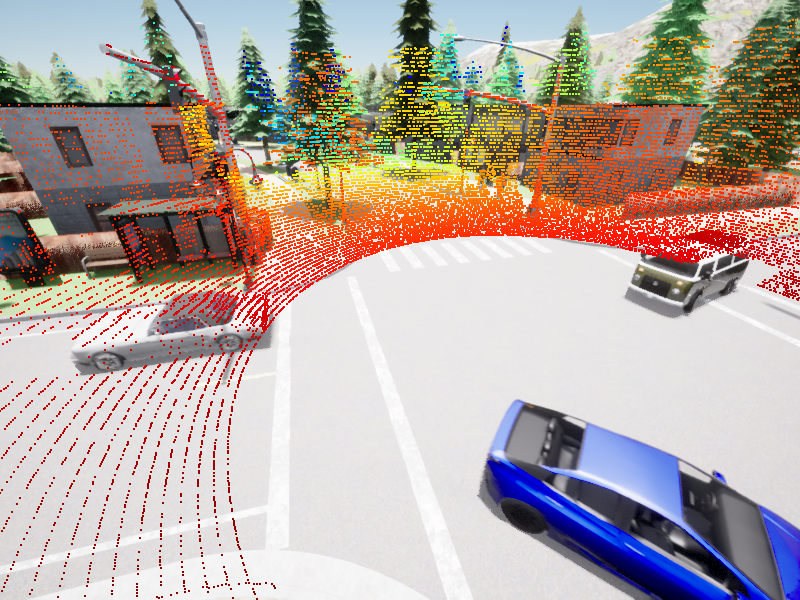

# dataset_tool

## Installation

## Step 1 Install Package and Environment

```
git clone https://github.com/zhz03/dataset_tool
cd dataset_tool
conda create -n datatool python=3.7
conda activate datatool
python setup.py develop
pip install -r requirments.txt
```

### Step 2 Install CARLA (Optional)

This is optional, if you need to use carla package for your simulation data, you will need to install the `carla` package:

```
export CARLA_HOME=/path/to/your/CARLA_ROOT # for example: /home/zzl/Carla/CARLA_0.9.12
export CARLA_VERSION=0.9.12 #or 0.9.14 depends on your CARLA
. setup.sh
```

Note:

If your python version is 3.8 or 3.9, then running `. setup.sh` will crash and you will have to mannually install carla package after you finish running `. setup.sh`:

```
# You will see a cache directory after you finish 
# And install it mannually:
export CARLA_VERSION=0.9.12
conda activate datatool
pip install -e $cache/carla-"${CARLA_VERSION}"-py3.7-linux-x86_64
```

### Pytorch

```
conda activate datatool
## CPU verions is ok
pip install torch torchvision torchaudio
```

## V2X-InfraSet Data Verification

### Lidar2Camera Verification

